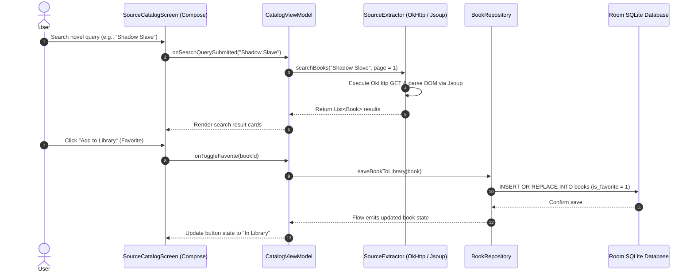
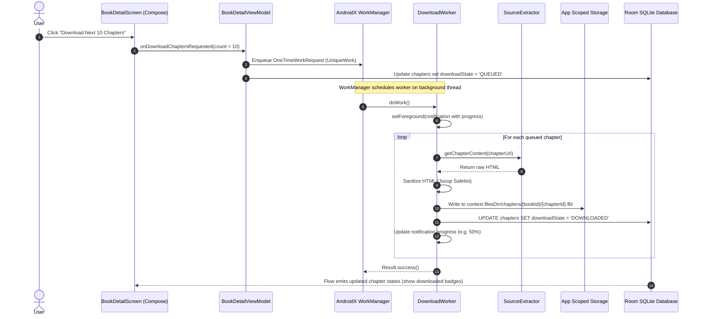
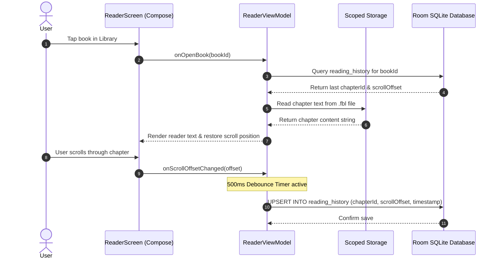

# 08 Core Feature Workflows

## 1. Source Browsing & Library Ingestion Workflow

This workflow coordinates discovering novels on an external web source and saving them to the user's local Room database library.

---

## 2. Background Chapter Download Workflow

This workflow coordinates queuing batch downloads, executing background work in WorkManager, writing files to Scoped Storage, and updating Room state.

---

## 3. Reading Session & Progress Checkpointing Workflow

This workflow manages opening a chapter from local storage, rendering the text, and debouncing reading progress saves to SQLite.

